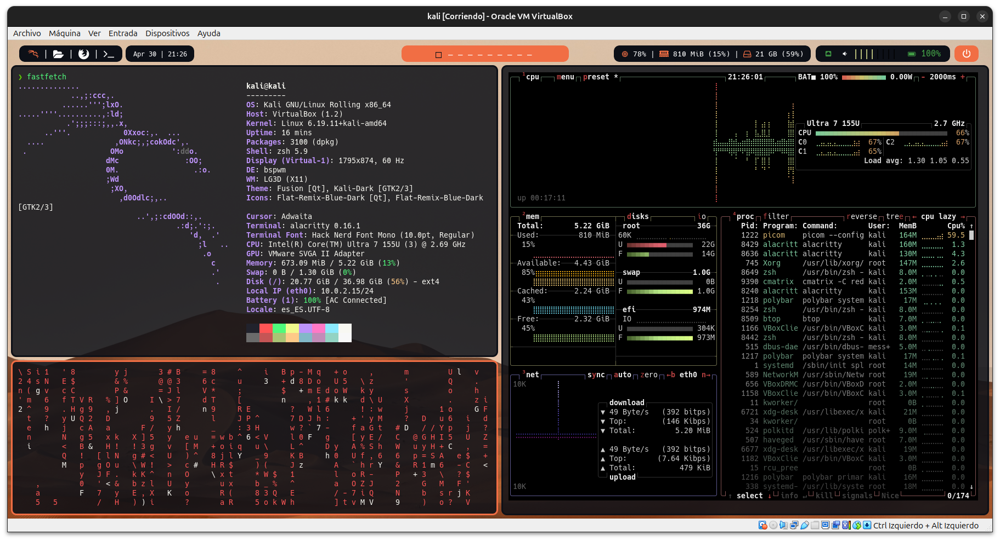

<div align="center">

# 🖥️ BSPWM Installer Pro


Script automatizado para configurar un entorno completo basado en **bspwm** en sistemas Debian/Ubuntu y derivados como Parrot OS.

</div>

<p align="center">
  
</p>

## 📑 Tabla de contenido

- [Características](#-características)
- [Capturas](#-capturas)
- [Requisitos](#-requisitos)
- [Instalación](#-instalación)
- [Créditos](#-créditos)
- [Licencia](#-licencia)

## ✨ Características

- Instalación automática de dependencias.
- Compilación de herramientas esenciales.
- Configuración del entorno de escritorio:
  - Zsh
  - Polybar
  - Picom
  - y más
- Copia automática de dotfiles.
- Personalización completa del sistema.

## ⚙️ Requisitos

- Sistema basado en Debian/Ubuntu.
- Usuario con permisos `sudo`.
- Conexión a internet.

> ⚠️ **No ejecutar como root.**

## 🚀 Instalación

```bash
git clone https://github.com/AmasterJT/linux-personalization.git
cd linux-personalization
chmod +x install.sh
./install.sh
```

## 🙌 Créditos

Desarrollado por **AmasterJT**.

Inspirado en la necesidad de automatizar y simplificar la configuración de un entorno **bspwm** funcional, limpio y personalizado.

## 📄 Licencia

Este proyecto está bajo licencia **Academic**.